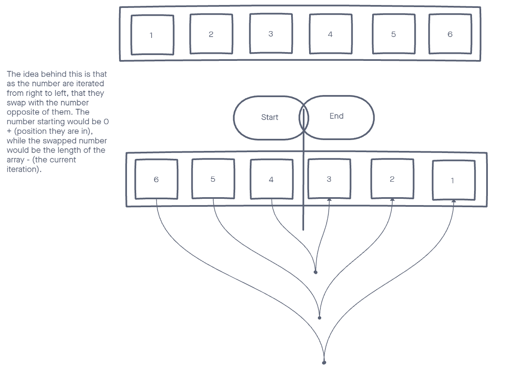

# Reverse an Array
Write a function called reverseArray which takes an array as an argument. Without utilizing any of the built-in methods available to your language, return an array with elements in reversed order.

## Whiteboard Process

## Approach & Efficiency
    -   If we can grab the ends of the array, we can just swap their values.
    -   Use a for loop to look at all the elements in the array.(iterating through the array).
    -   At each item, I swap with the inverse array index.
    -   Only go half way, and if the halfway mark is not a whole number,it stops.
    -   If we don't stop halfway we will re-swap.