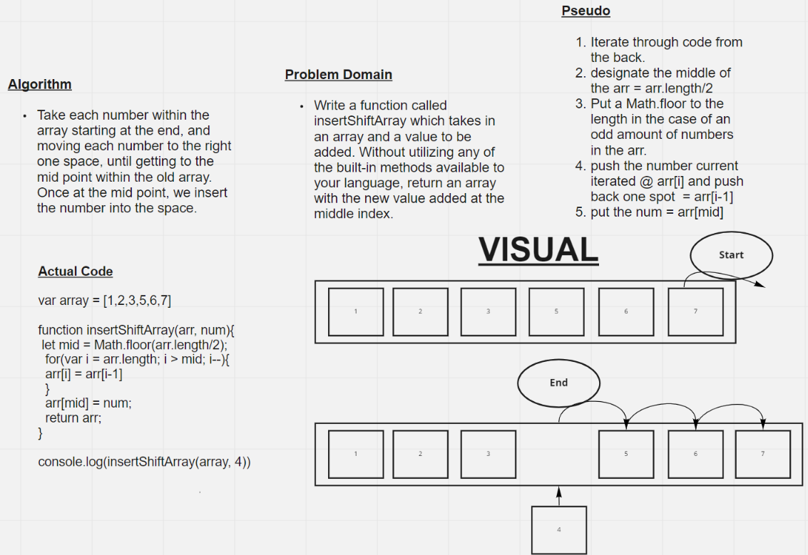

# Reverse an Array
Write a function called insertShiftArray which takes in an array and a value to be added. Without utilizing any of the built-in methods available to your language, return an array with the new value added at the middle index.
## Whiteboard Process

## Approach & Efficiency
    -   Take each number within the array starting at the end, and moving each number to the right one space, until getting to the mid point within the old array. 
    -   Once at the mid point, we insert the number into the space.