# Insertion Sort

Insertion Sort is a function that takes in an array, and transverses through each number, sorting the array in ascending order. If the current value is smaller than the previous value then the previous value takes over the current values position, and moves up the array. It continues until the entire array is sorted.  

## Pseudocode
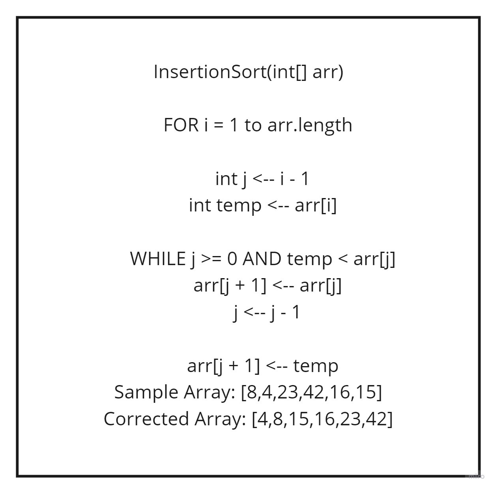

## Starting array:
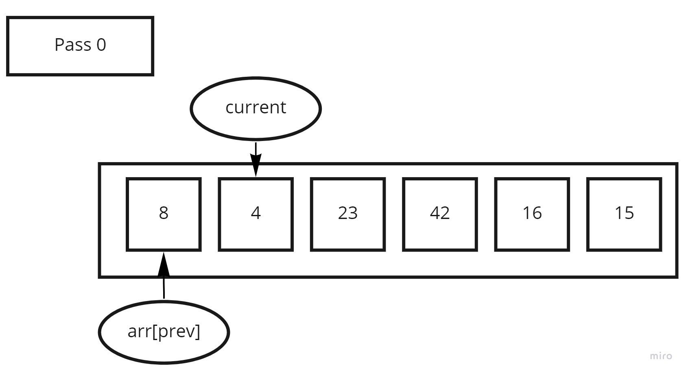

Pass 1:

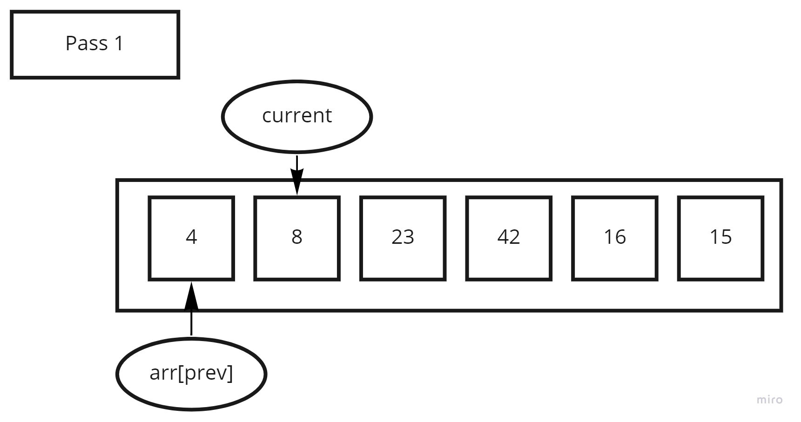
Pass 1  
    You start the 'for' loop at 1, and transverse through the array.
    Since the current value of (4) is less than the previous value of (8), and (8) is at position (0), you are able to enter the while loop.

    We then begin by setting the current value to the value of previous number, and by course we increase the number that j is on. The current value is then pushed back one index within the array. We then decrease j to set it back to being the number behind the current number being looked at, so that we can run the while loop again. We now see that the current value of (8) is greater than the previous value of (4), and exit our while loop for the first time.  

Pass 2:  

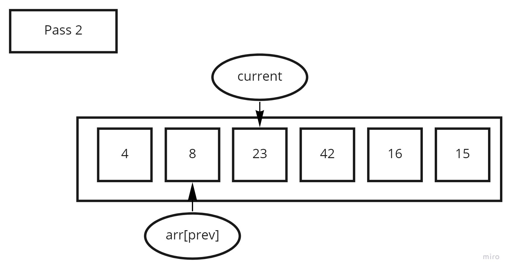  
Pass 2 of Insertion Sort  

    We start the next iteration of our 'for' loop at 2, and transverse through the array. 
    Since the current value of (23) is greater than the prev value of (8). We have no need to change anything and will be keeping the values as such.

Pass 3:  

 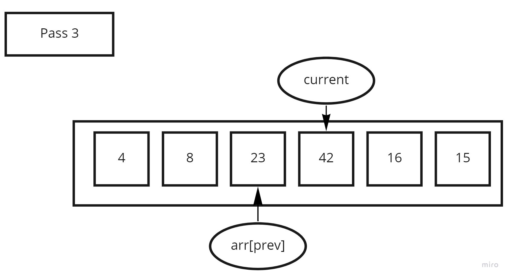  
Pass 3  

    We start the next iteration of our 'for' loop at 3, and transverse through the array.
    Since the current value of (42) is greater than the prev value of (23), we have no need to change anything and will be keeping the values as such.

Pass 4:  

 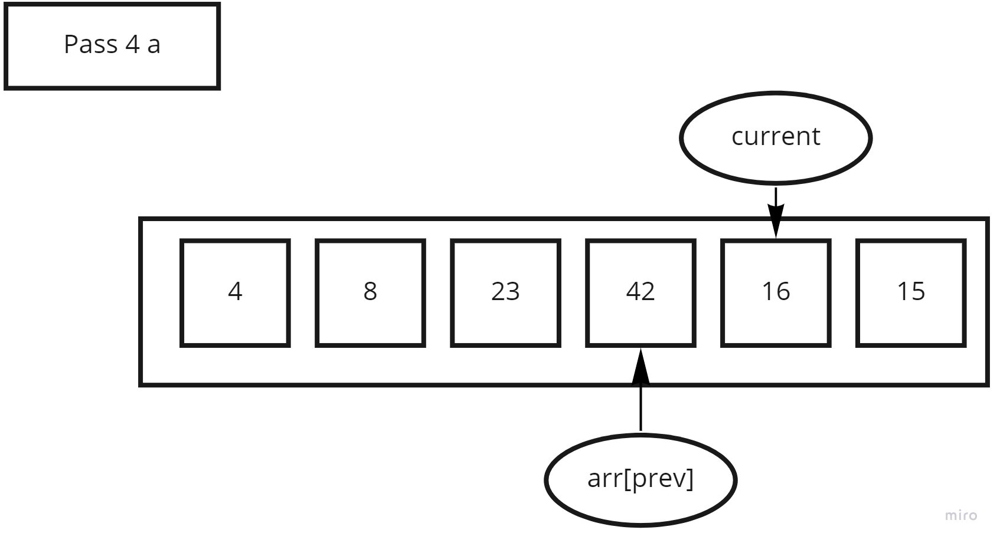  
Pass 4 part a  

    We start the next iteration of our 'for' loop at 4, adn transverse through the array.
    Since the current value of (16) is less than the prev value of (42), we now can go into the while loop.

    We start out by moving (42), one index over to where (16) was, and move the current index back one. The actual number value of previous is now decremented from where it was.

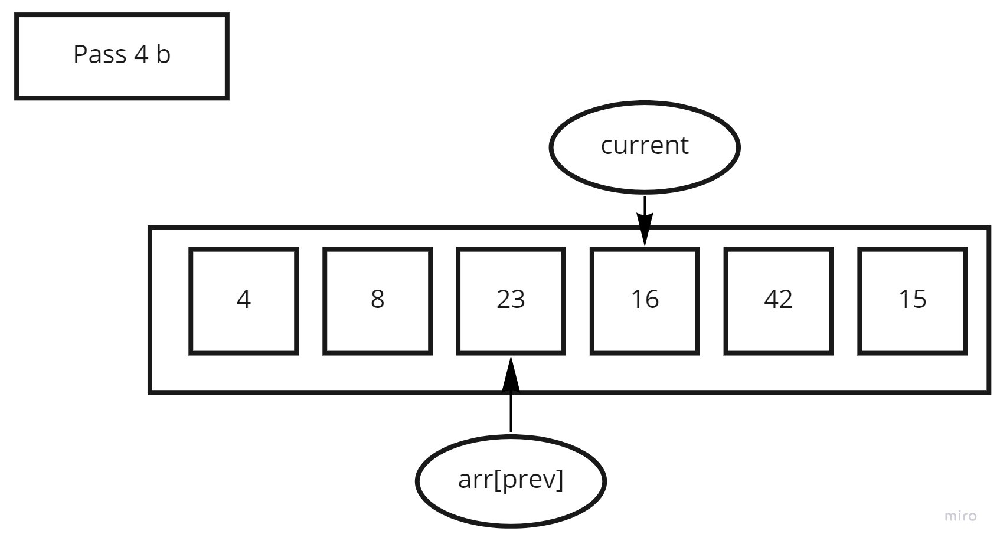  
Pass 4 part b  

    Still inside the while loop, we now see that 16 is less than (23). So we now move (23), one index over to where (16) resided, and move the current value of (16) over one.  

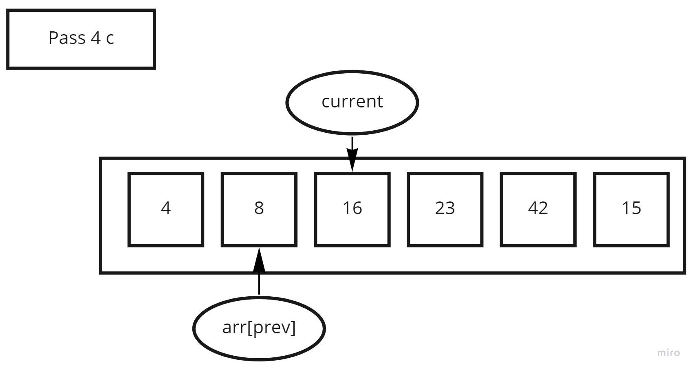  
Pass 4 part c  

    Still inside the while loop, we now check and see that the current value of (16) is greater than the prev value of (8). We have no need to change anything and will be keeping the values as such. 

Pass 5:  

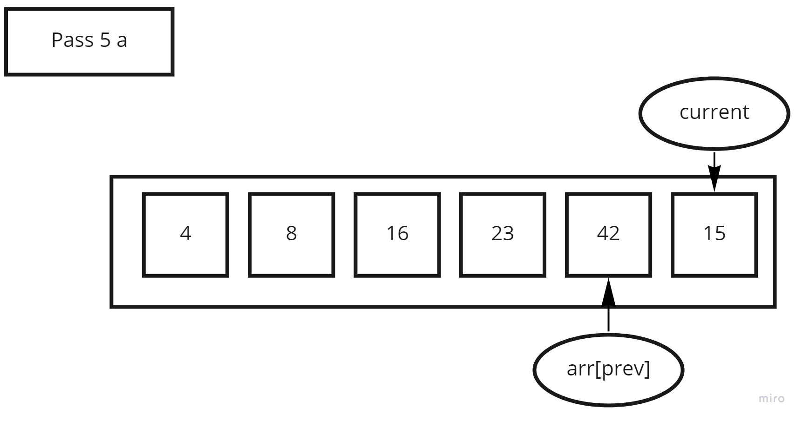  
Pass 5 part a  

    We start the next iteration of our 'for' loop at 5, and transverse through the array.
    Since the current value of (15) is less than the prev value of (42), we now can go into the while loop.

    We start out by moving (42), one index over to where (15) was, and move the current index back one. The actual number value of previous is now decremented from where it was.

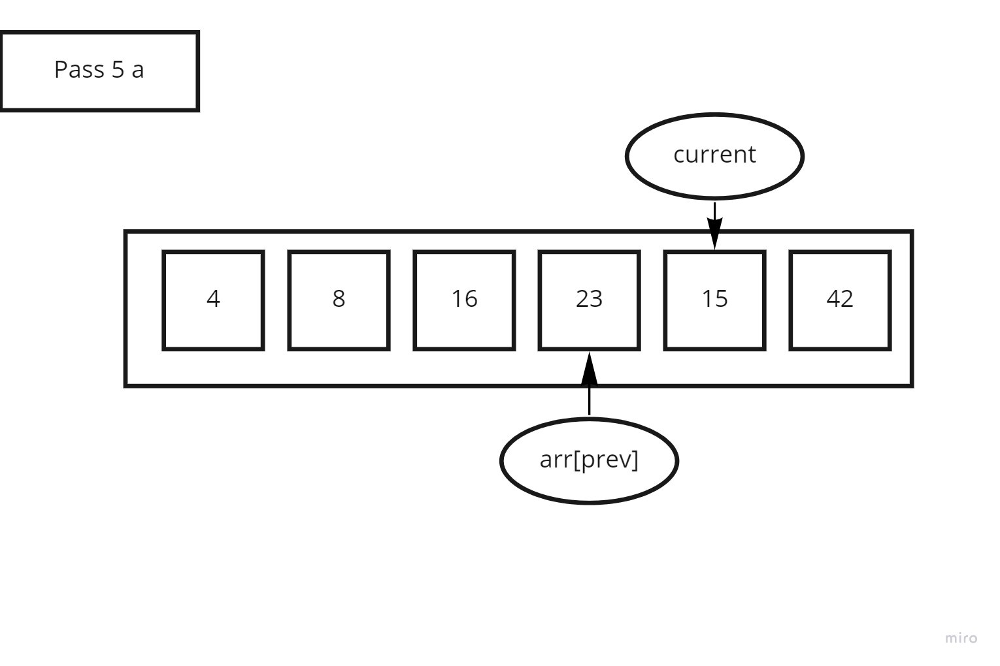  
Pass 5 part b  

    Still inside the while loop, we now see that (15) is less than (23). So we now move (23), one index over to where (15) resided, and move the current value of (15) over one.

  
Pass 5 part c  

    Still inside the while loop, we now see that (15) is less than (16). So we now move (16), one index over to where (15) resided, and move the current value of (15) over one.

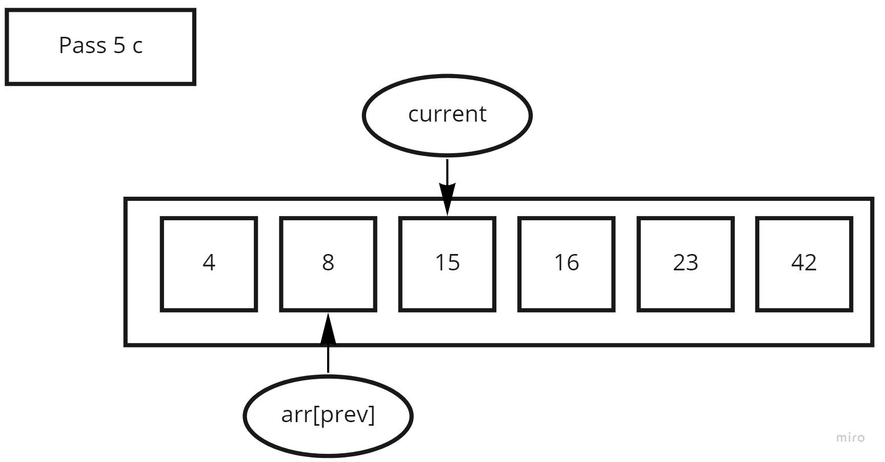  
Pass 5 part d  

    Still inside the while loop, we now check and see that the current value of (15) is greater than the prev value of (8). We have no need to change anything and will be keeping the values as such.

    And since we are now at the end of the array, we exit the while, and for loop, and return the array.

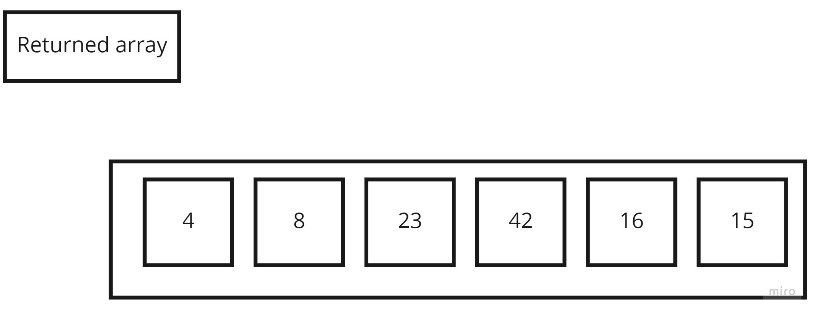  

## Efficency  

Time: O(n^2)  
The basic operation of this algorithm is comparison. This will happen n * (n-1) number of times…concluding the algorithm to be n squared.
Space: O(1)
No additional space is being created. This array is being sorted in place…keeping the space at constant O(1).