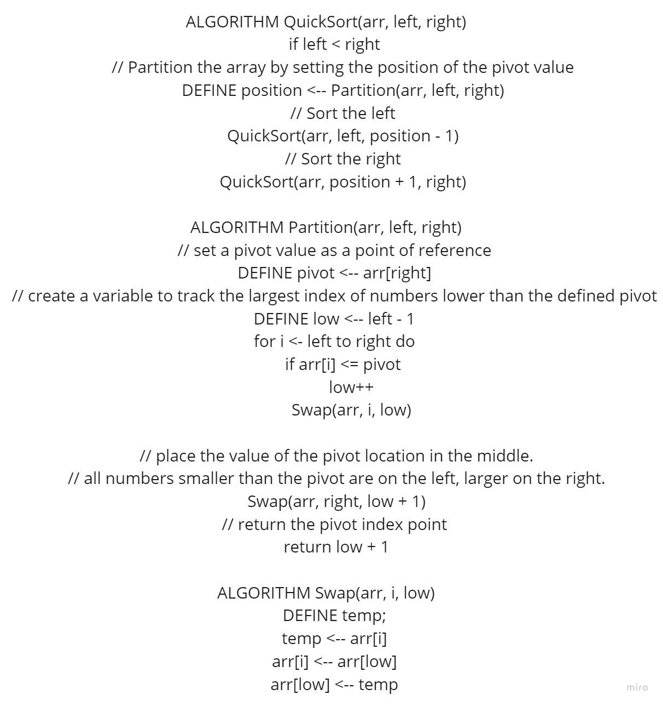
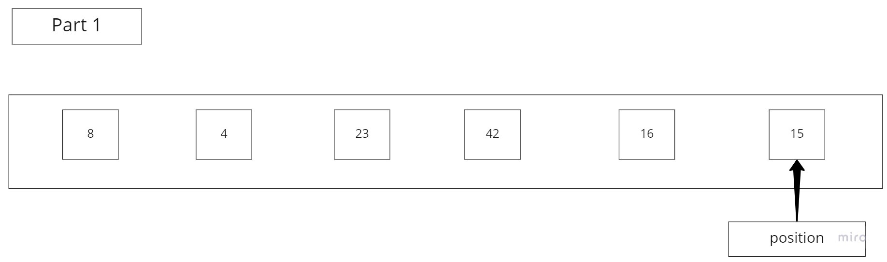
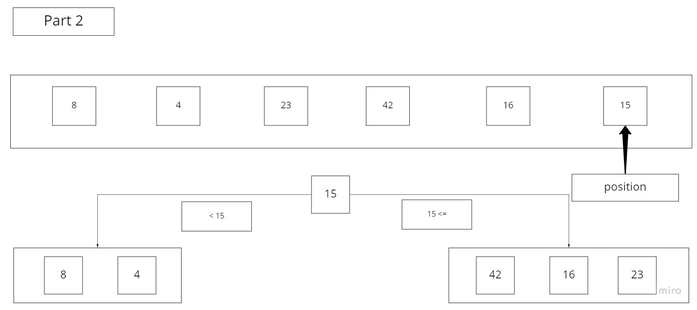
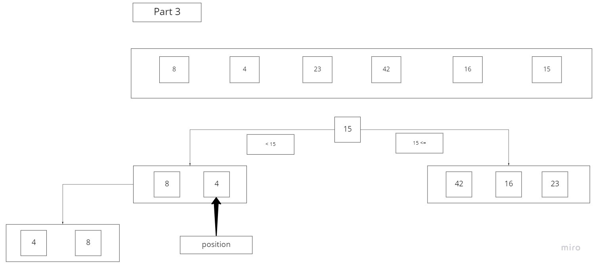
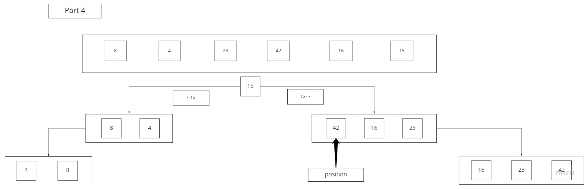
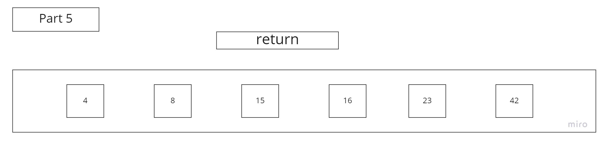

# QuickSort

Insertion Sort is a function that takes in an array, and transverses through each number, sorting the array in ascending order. If the current value is smaller than the previous value then the previous value takes over the current values position, and moves up the array. It continues until the entire array is sorted.  

## Pseudocode

## Starting array:

Pass 1:

Pass 1  

    You start with an unsorted Array, and have to define the pivot we are going to use to check against all numbers. 

Pass 2:  

  

Pass 2  

    We have divided the array into two to better show what integers are lesser than(left side) or greater than(right side) than the pivot.

Pass 3:  

  
Pass 3  

    We now check the left side, for our new pivot which is 4, and determine whether the other number less than 15 is greater than 4. 8 is greater so it goes on the right side of 4. 

Pass 4:  

  
Pass 4  

    We now check the right side, for our new pivot which 42, and determine whether the other 2 numbers greater 15 are greater than 42. 16 and 23 are lesser, 42 is moved all the way to the right, 16 is sorted to the very left, and 23 is sorted in the middle.

Pass 5:  

  
Pass 5

    We now have our final product which is the sorted array from least to greatest.
  
## Efficency  

Time: O(n)  
Because the amount of numbers within the array determine the length of time it will take to sort.
Space: O(lgn)
Becomes less complex as we start to sort the array.
