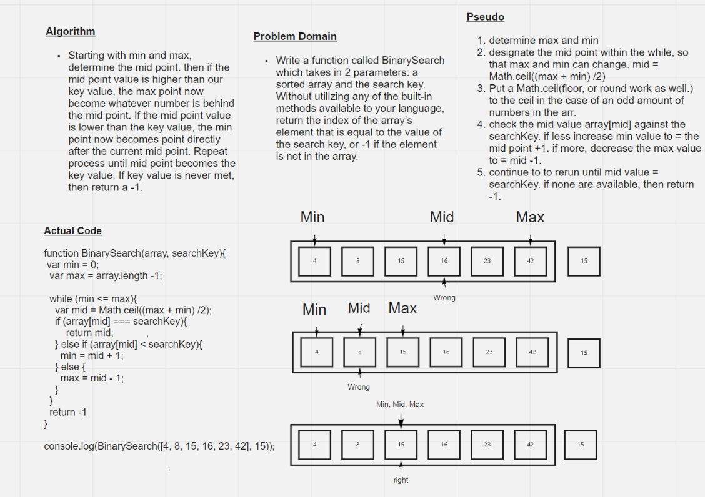

# Binary Search of Sorted Array
Write a function called BinarySearch which takes in 2 parameters: a sorted array and the search key. Without utilizing any of the built-in methods available to your language, return the index of the array’s element that is equal to the value of the search key, or -1 if the element is not in the array.

## Whiteboard Process

## Approach & Efficiency
- I assigned a high and low, and then checked the mid point, and reasigned the mid point based on the value of that mid point compared to the search key value. 
- If the mid point value was higher than the search key value, then we decrease the max point to be one step lower than the mid point. 
- If it was mid point value was lower than the search key value then increase the min point to be one step higher than the mid point. 
- Repeat process till mid value was the same as key search value, and return a -1 if the value was never the same.