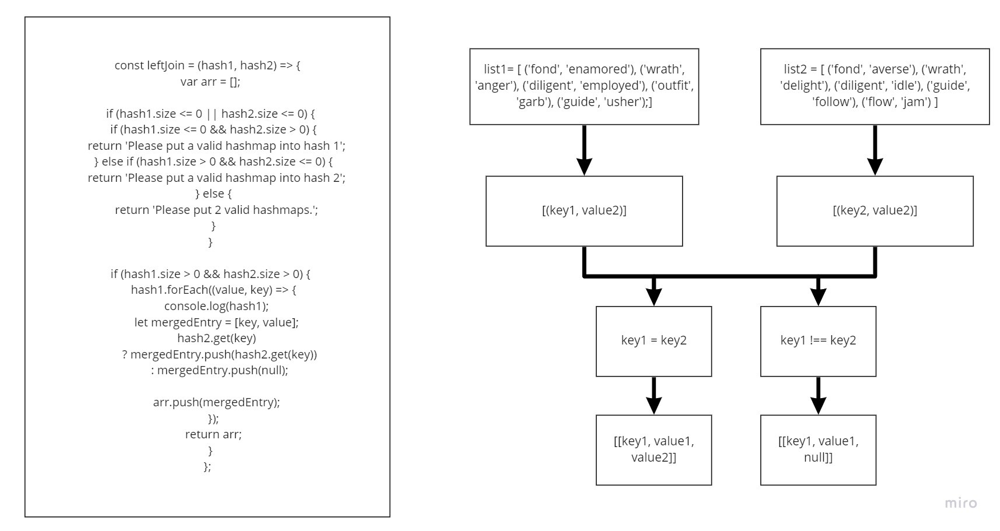

# Challenge Summary  

- Write a function called left join  
- Arguments: two hash maps  
  - The first parameter is a hashmap that has word strings as keys, and a synonym of the key as values.  
  - The second parameter is a hashmap that has word strings as keys, and antonyms of the key as values.  
- Return: The returned data structure that holds the results is up to you. It doesn’t need to exactly match the output below, so long as it achieves the LEFT JOIN logic  

## UML

## Approach & Efficiency  

O(n) - Time;  
O(n) - Space;  

## Solution  

[Solution/Code](https://github.com/bpfingston/data-structures-and-algorithms/blob/main/javascript/401/Challenge-32/module/left-join.js);  
[Test](https://github.com/bpfingston/data-structures-and-algorithms/blob/main/javascript/401/Challenge-32/__Test__/challenge33.test.js)  
